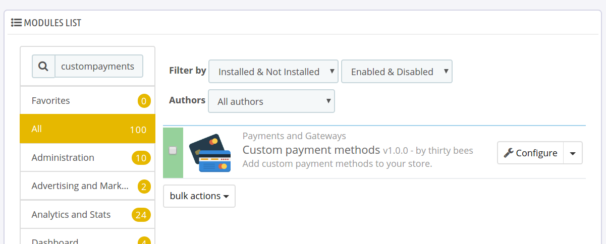
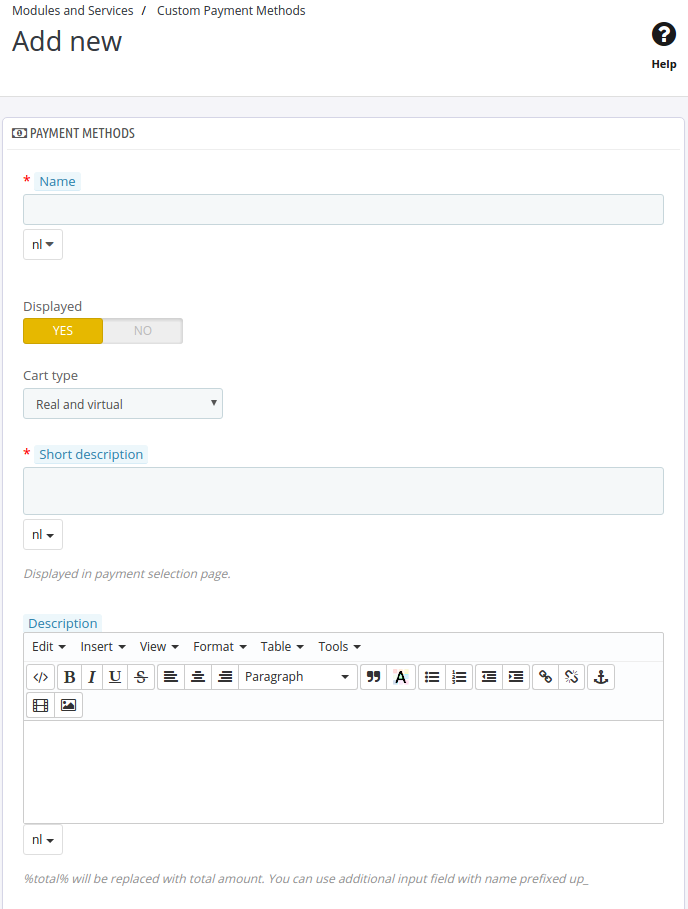

# Custom Payment Methods module by thirty bees

## Setting up the Custom Payment Methods module

You can simply install the module from your back office and it will give you an extra menu item which can be found at "Modules and Services > Custom Payment Methods".
Besides an explanation on how to install this module, this guide will also briefly explain how to add a payment method via the new back office page that allows you to manage offline payment methods.

### Installing the Custom Payment Methods module  

On the back office, navigate to Modules and Services, List of Modules, Payments and Gateways.

- Search for **custompayments** from the module list
- Click **Install**  

### Configuring custom payment methods

Visit "Modules and Services > Custom Payment Methods". Click the + button to add a new payment option. Here you can configure everything to your liking. Let's go through the options on this page:  

- **Name**: this is displayed on the checkout
- **Displayed**: show the payment method on the checkout
- **Cart type**: what kind of products does this module support (virtual and/or real)
- **Short description**: the short description that is shown underneath the name on the checkout page
- **Description**: the full description that is shown when the confirmation button has been enabled on this module's configuration page and the payment method is clicked on the checkout page (only when not using the EU checkout)
- **Description success**: shown on the order confirmation page
- **Image**: upload a logo for your payment method (you can configure the dimensions on this module's configuration page)
- **Carrier**: only show this carrier for the chosen carriers
- **Groups**: when this feature is enabled you can limit this payment method to several groups
- **Order discount**: if cart rules have been found, this option becomes available and you can optionally apply a cart rule when this payment method is chosen during the checkout

Click `Save` to save your configuration and the payment method has just become available. If you want to further tweak the availability of this module, visit the back office page "Module and Services > Payment" to set restrictions such as currency, country, carrier, etc.
