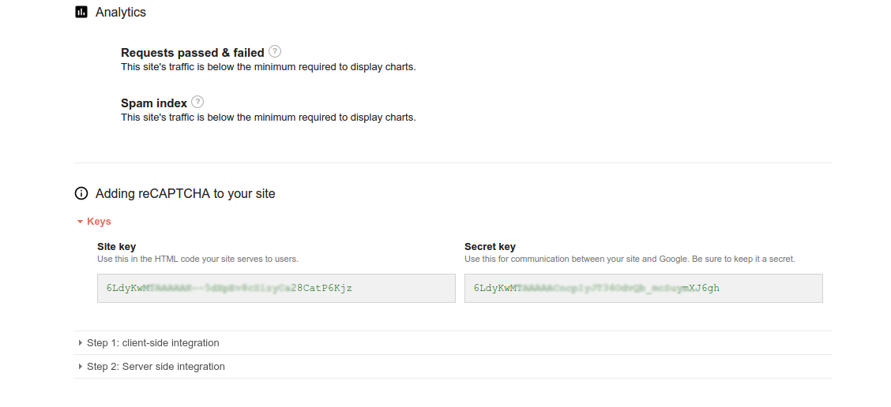
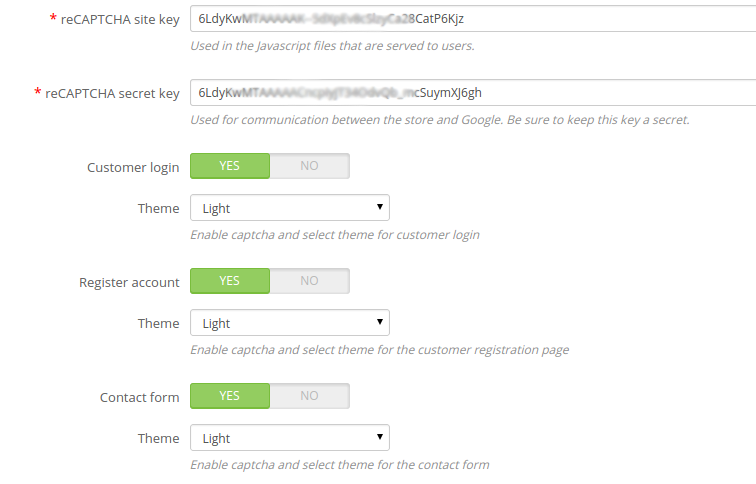

# No CAPTCHA reCAPTCHA by thirty bees

## Setting up the module

Installing and configuring the module consists of 5 steps: 
1. Retrieving your Google reCAPTCHA credentials
1. Entering your Google reCAPTCHA credentials
1. Selecting where you want to display the captcha
1. Make sure you clear the cache of your store and checking a few settings
1. Check if the captchas display properly.

### Retrieving your Google reCAPTCHA credentials

Register your domain with reCAPTCHA and find your secret and site keys. Via [https://www.google.com/recaptcha/intro/index.html](https://www.google.com/recaptcha/intro/index.html) you can register your domain for reCAPTCHA.
Click Get reCAPTCHA. After you’ve logged in, you will see a window that is comparable to figure 1. On this screen you can add a label and domain name. It is important to note that you will only need to enter the main domain. It is not necessary to enter any subdomains. After the domain has been added it will be shown in the table above. An example is shown in figure 2.
Click on the domain in this table. Afterwards, click Keys. A screen with extra information appears. It includes both the Site key and Secret key that are needed. Figure 3
is an example.

### Entering your credentials

You can enter the credentials on the module's configuration page.

### Selecting where you want to display the captcha

Select the forms on which you would like to enable the captchas and optionally pick a theme. You can choose between a light and dark theme. These can be adjusted for every type of form.
Currently the module supports:
- Login page
- Registration page
- Password forgotten form
- Contact form
- Back Office login form

### Make sure you clear the cache of your store and checking a few settings

Visit `Advanced Parameters > Performance` and clear the cache. Make sure that
both `Disable non PrestaShop modules` and `Disable all override` are set to `NO`. This
step makes sure that backend checks can be performed without problems.

### Check if the captchas display properly.

If not, you might have to tweak the advanced settings. Here you can set the displayed HTML and the jQuery selector to place the captcha.
