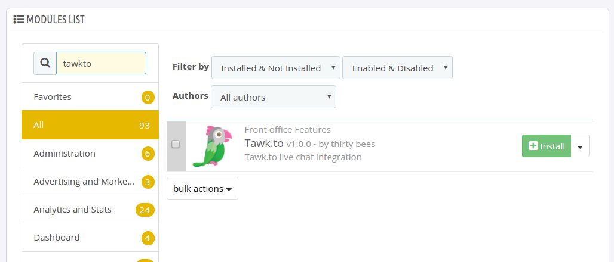
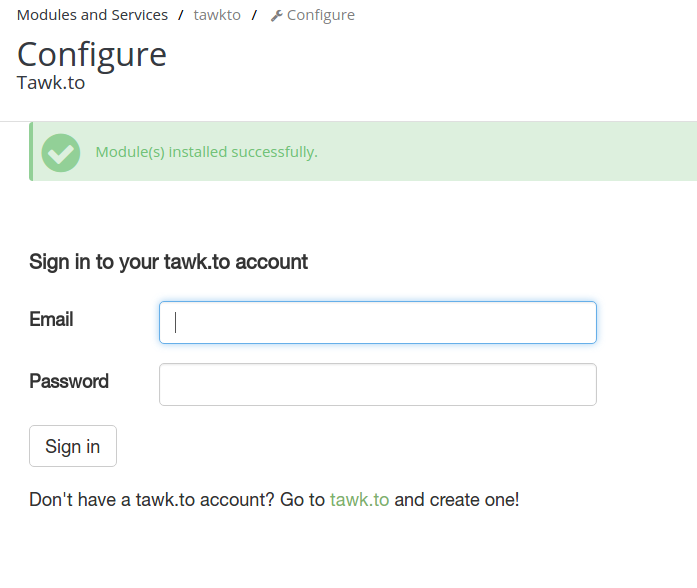
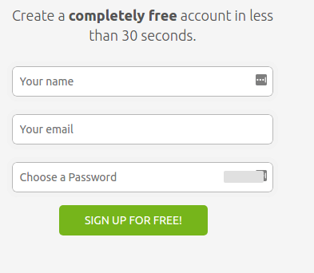
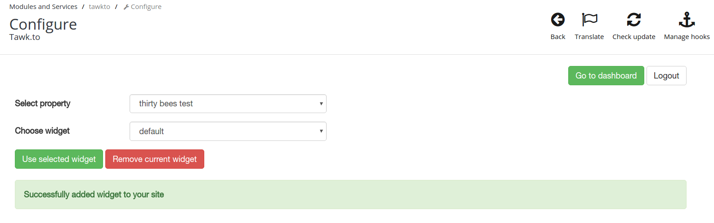

#tawk.to Module by thirty bees

tawk.to is a free service that allows you to chat with your site's customers. It is very easy to integrate in your store with thirty bees' native module for tawk.to.  
For more info head over to their website: [https://tawk.to/](https://tawk.to/)

## Specifications
+ **Included in feed:** Yes
+ **Uses overrides:** No
+ **Compatible versions:** All
+ **Location:** Front Office Features
+ **Change log:** [View Releases](https://github.com/thirtybees/tawkto/releases)

## Installing the tawk.to module  

Navigate to your module list on the BO page "Modules and Services > Modules and Services". Search for `tawkto` and install the module.

## Setting up the tawk.to Module  

After you have successfully installed the tawk.to module you will be presented with the module's configuration page. It is a very simple and minimal interface, meant to get you started as quickly as possible. 
The first time you open up this page you will see a login form. If you already have a tawk.to account, enter your credentials and click `Sign in`. Otherwise go to [https://tawk.to/](https://tawk.to/) and sign up for a tawk.to account.

### Signing up for tawk.to

You can create a new account on [https://tawk.to/](https://tawk.to/). The signup form will be on the frontpage.

### Configuring the module

After you have successfully created an account and logged in on the module page you can choose a widget. Make sure you click `Use selected widget` to make the widget active. The chat widget is now shown and live on your front office. Further configuration of the widget is done via your tawk.to dashboard. Click the `Go to dashboard` button to visit your dashboard (mobile users: scroll all the way to the right first).

